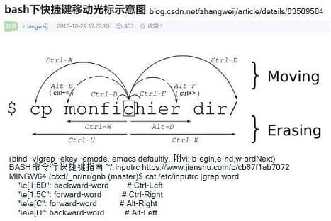

# tt20a
tt20a-test20200511-first

https://git-scm.com/book/zh/v2/Git-基础-查看提交历史 https://php.cn/manual/view/34971.html
## //started
https://github.com/join/get-started  
https://github.com/new  
https://github.com/organizations/plan  
https://lab.github.com/  
actions  
https://github.com/asbcd20z  
https://github.com/asbcd20z?tab=repositories  
https://github.com/features/codespaces  
https://github.com/asbcd20z?tab=projects  
https://github.com/asbcd20z?tab=stars  
https://gist.github.com/mine  
https://help.github.com/en/packages/publishing-and-managing-packages/about-github-packages#supported-clients-and-formats  
https://help.github.com/en/github/collaborating-with-issues-and-pull-requests/about-pull-requests  
https://gitlab.com/help/topics/autodevops/index.md  
https://gitlab.com/users/asbcd20z/starred  
https://gitlab.com/explore  
https://gitlab.com/explore/projects/topics  
//authentication  
https://github.com/microsoft/Git-Credential-Manager-Core/blob/master/docs/github-apideprecation.md  
https://docs.github.com/en/rest/overview/other-authentication-methods#basic-authentication  
https://docs.github.com/en/github/authenticating-to-github/creating-a-personal-access-token  
## //Quick setup
```
…or create a new repository on the command line
echo "# test20210207b" >> README.md
git init
git add README.md
git commit -m "first commit"
git branch -M main
git remote add origin git@github.com:asbcd20z/test20210207b.git
git push -u origin main
==git branch -u origin/main main;  git push  origin main
…or push an existing repository from the command line
git remote add origin git@github.com:asbcd20z/test20210207b.git
git branch -M main
git push -u origin main
…or import code from another repository
You can initialize this repository with code from a Subversion, Mercurial, or TFS project.
```

```
bash下快捷键移动光标示意图:
ctr-A, ctr-E  移动行首，行尾
alt-B, alt-F  移动词前，词后 //or: ctr-<, ctr->
ctr-B, ctr-F  移动字前，字后
ctr-U, ctr-K  删去至行首，行尾
ctr-W, alt-D  删去至词前，词后
--
ctr-Y  粘贴ctr+u/k剪切的内容
ctr-xx 再命令行尾和光标之间移动toggle
ctr-L  进行清屏, reset
===
-echo -e 'aa-join-lines\nbbb\nc'| for i in `cat -` ; do echo -n "$i, "; done
-echo aa |sed 'i\\' |hexdump.exe  -C
-echo -e '1aa\n2bb\n3c' |sed -e'\=bb= i\\nXX-\n' -e'$ aY-' -e'$ iZ-'
-echo -e '1aa\n2bb\n3c' |sed -e'\=bb= s/^/\n/'   -e'$ aY-' -e'$ iZ-'
-
-echo  -e 'AA\bBBCC'|tr -c '[:graph:][:blank:]\n' -|hexdump -C
-echo  -e 'AA\bBBCC'|tr -c '[:print:][:blank:]\n' -|hexdump -C
-python3 -B -c "for i in range(128):print('%c' %i, end='');" |hexdump -C
-python3 -B -c "for i in range(128):print('%c' %i, end='');" |tr -c '[:print:][:blank:]\n' - |hexdump -C
--
-echo -e 'a\0177b'； echo -e 'a\x7fb' |hexdump -C
-python3 -B -c "for i in range(128):print('%c' %i, end='');" |tr '\0-\037\177' '0-8\t\nB-Z' |hexdump -C
-python3 -B -c "for i in range(128):print('%c' %i, end='');" |tr  -c '[:print:]' - |hexdump -C  #transform all ~print to one '-'
-python3 -B -c "for i in range(128):print('%c' %i, end='');" |tr -c '[:graph:]' x |hexdump -C   #[:print:][:cntrl:][:space:][:blank:][:punct:]
ASCII码一览表，ASCII码对照表,  http://c.biancheng.net/c/ascii/
-echo -e 'aa\r\nb\rc\rd' |sed -e 's/\r/-/g' |hexdump -C   ##ps, sed take '\r\n' as one-char\n??
-echo -e 'aa\r\nb\rc\rd' |sed -be 's/\r/-/g' |hexdump -C  #binary, ok
-echo -e 'aa\r\nb\rc\rd' |sed -e 's/\r/\n/g'  |hexdump -C
-echo -e 'AA\r\nBB\rC' |sed -b -e's/\r$/-/g' -e's/\r/\n/g' | hexdump -C  ##can't match \n or $
-sed中字符\xe4(参man echo),但 tr中字符\344(参man tr)
-cat ../../tmp2/aaa2 |sed 's/\xe4/a/' |hexdump -C
-cat ../../tmp2/aaa2 |tr '\344' a |hexdump -C
$ cat ../../tmp2/aaa2; cat ../../tmp2/aaa2 |hexdump -C
A中b‘c’d 11100101
00000000  41 e4 b8 ad 62 e2 80 98  63 e2 80 99 64 20 31 31  |A...b...c...d 11|
00000010  31 30 30 31 30 31 0a                              |100101.|
00000017
===
```

//  
sublime Text中的workspace和project什么关系?  https://www.zhihu.com/question/22681628  //Ctrl+Shift+N  
//http://www.sublimetext.com/docs/3/projects.html  
https://docs.github.com/en , https://github.com/settings/profile  
?tab=repositories , tab=projects , tab=stars ,   
ip查询地址 https://tool.lu/ip/  
gitee自动同步github  
`1` aa
```
https://gitee.com/giteemirror/free-programming-books-zh_CN
https://github.com/EbookFoundation/free-programming-books/blob/master/CONTRIBUTING-zh.md
bb
ccc
```

## //GNU/linux/c
```
https://www.gnu.org/ , https://www.fsf.org/resources/ , http://directory.fsf.org/
GNU Manuals Online  https://gnu.huihoo.org/
https://www.gnu.org/software/
https://www.gnu.org/software/libc/manual/
https://gcc.gnu.org/onlinedocs/
https://www.gnu.org/software/gdb/documentation/
--
Linux C/C++编程手册查阅方法  https://www.cnblogs.com/findumars/p/6653704.html
The Linux man-pages project https://www.kernel.org/doc/man-pages/  https://man7.org/linux/man-pages/
https://www.runoob.com/cprogramming/c-standard-library.html
https://man7.org/linux/man-pages/man1/bash.1.html#EXPANSION
https://man7.org/linux/man-pages/man1/bash.1.html#REDIRECTION
https://linux.die.net/man/5/ssh_config (vscode ssh remote: IdentityFile ~/.ssh/id_rsa, gitlens)
https://www.cnblogs.com/liyufeia/p/11405779.html (cat id_rsa.pub >> authorized_keys //ssh-copy-id)
lexical/syntax/semantically
```
